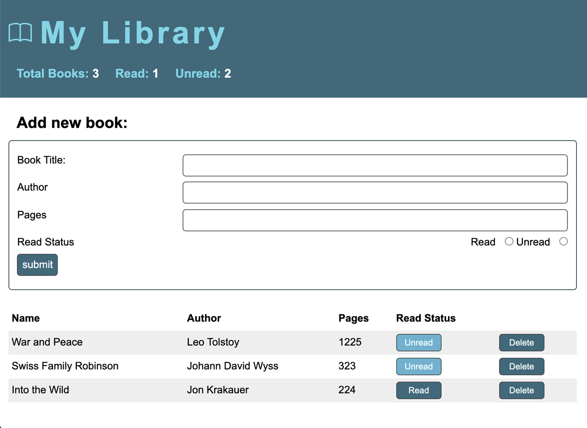

# _My Library_

#### This is a browser-based personal library app that keeps track of all your books and helps remind you which ones you still need to read.

#### _06/2021_

#### By _**Chris Korsak**_

## Description

This library application is a project from [The Odin Project](https://www.theodinproject.com/paths/full-stack-javascript/courses/javascript/lessons/library) full-stack Javascript course. It notably uses javascript constructor functions to create _book_ objects and also utilizes object prototype methods to update object data.

Additionally, this application uses local browser storage for persistent data without needing a database.

### Features
* Display of total books in library and total books read/unread
* Add new books using a form (title, author, pages, and read-status)
* Ability to change book read-status after adding to library
* Ability to delete a book from library

## Setup/Installation Requirements

None. This is a web-based application hosted on Github pages. Check out the app [here!](https://chriskorsak.github.io/library/)

## Technologies Used

* HTML
* CSS (including variables)
* Javascript (including local storage, javascript constructors, and prototype methods)

## License

Copyright (c) 2021 **_Chris Korsak_** All rights reserved.
  
